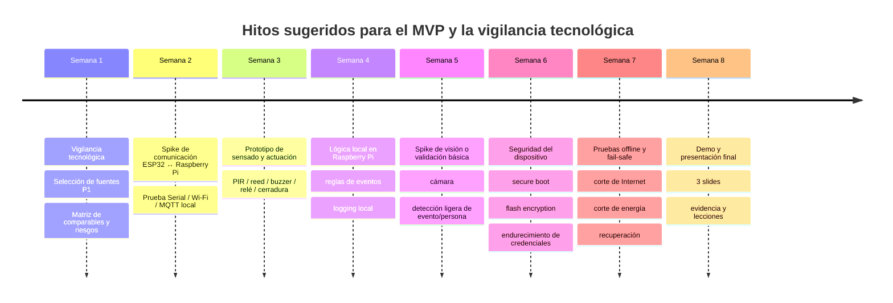

# Vigilancia tecnológica para un sistema de bloqueo inteligente con Edge Computing

## Resumen ejecutivo

Para un MVP de “bloqueo inteligente de negocios y hogares” basado en Raspberry Pi 5 + ESP32, la combinación de fuentes más útil no es una sola familia documental, sino un **stack de evidencia**: artículos fundacionales sobre edge computing, normas oficiales de ciberseguridad para IoT, páginas técnicas de productos comerciales comparables y repositorios open source que prueban viabilidad real en hardware embebido. La conclusión de mayor confianza es que el argumento técnico del proyecto debe apoyarse en tres ideas: **decisión local para baja latencia**, **autonomía operacional ante caídas de Internet** y **minimización de exposición de datos sensibles**. Eso está bien soportado por literatura académica y por guías oficiales de fabricantes y organismos de referencia como entity["organization","NIST","us standards agency"], entity["organization","ETSI","telecom standards body"], entity["organization","ISO","international standards body"] y entity["organization","ONVIF","ip video interoperability forum"]. citeturn35search3turn17search8turn18search16turn23view2turn19view4turn19view5turn19view6turn22view3

Como referencias de mercado, los comparables más fuertes no son exactamente “smart locks DIY”, sino sistemas que ya incorporan **analítica en cámara o en gateway**: entity["company","Hikvision","video surveillance company"] AcuSense, entity["company","Axis Communications","network video company"] Object Analytics/ACAP y el legado de analítica en el borde de entity["company","Bosch","engineering company"] IVA Pro. En consumo masivo, entity["company","Ring","smart home security company"] y entity["company","Google Nest","smart home brand"] son útiles como benchmark comercial, pero sus páginas oficiales muestran un patrón distinto al de su MVP: más dependencia de ecosistema, app y nube, o al menos de conectividad sostenida, que de una arquitectura completamente autónoma en el borde. citeturn19view10turn19view11turn22view1turn19view12turn22view2turn19view7turn26search16turn19view8turn19view9

Desde la viabilidad de implementación, la documentación oficial de entity["company","Raspberry Pi","single-board computer company"] y entity["company","Espressif","semiconductor company"], junto con documentación de Home Assistant, ESPHome y repositorios open source, respalda muy bien una arquitectura partida como la de su README: sensores y actuadores simples en ESP32; coordinación, lógica, registro e inferencia ligera en Raspberry Pi 5. Esto es especialmente fuerte para un discurso de clase porque permite mostrar no solo “estado del arte”, sino también **cómo se implementa hoy** en plataformas reales. citeturn19view0turn19view1turn19view2turn19view3turn19view14turn19view15turn19view16turn19view17turn20view0turn20view2

La recomendación práctica para sus 2–3 diapositivas es **no intentar resumir toda la revisión**, sino concentrarse en un relato muy claro: “qué resuelve nuestro sistema”, “qué ya existe en academia y mercado”, y “por qué nuestro MVP se diferencia por autonomía local, privacidad y costo/controleabilidad”. Ese enfoque está mejor alineado con la evidencia de mayor peso encontrada. citeturn21view0turn21view1turn30search16turn19view10turn19view11turn19view12turn19view8turn19view9

## Criterios para priorizar fuentes

Para este reporte, la priorización más útil para el MVP es la siguiente. En **prioridad P1** coloco lo que ayuda directamente a justificar decisiones de arquitectura, seguridad y operación offline. En **P2** lo que ofrece comparables de mercado o patrones de implementación cercanos. En **P3** lo que amplía contexto, riesgo o propiedad intelectual, pero no define por sí solo el diseño del MVP. Esta jerarquía está alineada con la literatura fundacional sobre edge computing, con los baselines de IoT de NIST y ETSI, y con la evidencia comercial sobre edge analytics y dependencia de nube en productos domésticos. citeturn35search3turn17search8turn18search16turn23view2turn19view4turn19view5turn19view7turn19view8turn19view10turn19view11

| Prioridad | Qué responde | Qué debería aparecer en la presentación |
|---|---|---|
| **P1** | ¿Por qué edge y no cloud pura? ¿Qué controles mínimos de seguridad y privacidad exige un producto IoT? | La justificación del diseño y 3–4 decisiones de arquitectura |
| **P2** | ¿Qué productos o proyectos ya hacen algo parecido? | Benchmark de mercado y comparables técnicos |
| **P3** | ¿Qué riesgos de patentabilidad o saturación tecnológica existen? | Una lámina de riesgo/IP o una nota oral breve |

## Bibliografía priorizada

### Académicas

| Ref. | Prioridad | Cita completa | URL | Relevancia para el proyecto y bullet sugerido | Credibilidad / Acceso |
|---|---|---|---|---|---|
| **A1** | P1 | Shi, W., J. Cao, Q. Zhang, Y. Li y L. Xu, “Edge Computing: Vision and Challenges,” *IEEE Internet of Things Journal*, vol. 3, no. 5, pp. 637–646, 2016. | `https://doi.org/10.1109/JIOT.2016.2579198` | **Relevancia.** Es la fuente fundacional para defender por qué una decisión de seguridad física no debería depender de ida y vuelta a la nube: el artículo enmarca edge como cómputo cercano al origen y lo conecta con latencia, ancho de banda y privacidad. **Bullet sugerido.** “En seguridad física, el tiempo de reacción y la continuidad del servicio favorecen procesamiento local.” citeturn35search3turn35search6 | Alta / Pago con copias accesibles |
| **A2** | P1 | Yu, W., F. Liang, X. He, W. G. Hatcher, C. Lu, J. Lin y X. Yang, “A Survey on the Edge Computing for the Internet of Things,” *IEEE Access*, vol. 6, pp. 6900–6919, 2018. | `https://doi.org/10.1109/ACCESS.2017.2778504` | **Relevancia.** Sirve para mostrar que su proyecto no es un caso aislado, sino una aplicación clásica de edge-IoT: sensores distribuidos, procesamiento local y coordinación con posibles servicios externos. **Bullet sugerido.** “Nuestro sistema encaja en el patrón edge-IoT: sensores cercanos, decisión local y nube opcional.” citeturn17search0turn17search8 | Alta / Pago |
| **A3** | P1 | Premsankar, G., M. Di Francesco y T. Taleb, “Edge Computing for the Internet of Things: A Case Study,” *IEEE Internet of Things Journal*, vol. 5, no. 2, pp. 1275–1284, 2018. | `https://doi.org/10.1109/JIOT.2018.2805263` | **Relevancia.** Aporta una visión aplicada del paso de cloud a edge en IoT y es muy útil para justificar un diseño híbrido: funciones críticas locales y funciones no críticas fuera del dispositivo. **Bullet sugerido.** “El edge no elimina la nube: la relega a monitoreo, respaldo y análisis no críticos.” citeturn18search0turn18search16 | Alta / Mixto |
| **A4** | P1 | Aishwarya, D. y R. I. Minu, “Edge computing based surveillance framework for real time activity recognition,” *ICT Express*, vol. 7, no. 2, pp. 182–186, 2021. | `https://doi.org/10.1016/j.icte.2021.04.010` | **Relevancia.** Es probablemente el paper más cercano a su narrativa de “vigilancia tecnológica” porque aterriza edge computing en detección de actividad sospechosa en CCTV usando CNN y alertas en tiempo real. **Bullet sugerido.** “Ya existe evidencia académica de vigilancia en tiempo real sobre edge para detección de actividades sospechosas.” citeturn21view1 | Alta / Abierto |
| **A5** | P1 | Cob-Parro, A. C., C. Losada-Gutiérrez, M. Marrón-Romera, A. Gardel-Vicente e I. Bravo-Muñoz, “Smart Video Surveillance System Based on Edge Computing,” *Sensors*, vol. 21, no. 9, art. 2958, 2021. | `https://doi.org/10.3390/s21092958` | **Relevancia.** Muy valioso para su caso porque demuestra un sistema de videovigilancia distribuida con inferencia AI en nodos embebidos de bajo consumo y cuantifica precisión, rendimiento y energía. **Bullet sugerido.** “La videovigilancia inteligente ya se está moviendo de centros de cómputo a nodos embebidos de borde.” citeturn21view0 | Alta / Abierto |
| **A6** | P2 | Pathak, T., V. Patel, S. Kanani, S. Arya, P. Patel y M. I. Ali, “A distributed framework to orchestrate video analytics across edge and cloud: a use case of smart doorbell,” en *Proceedings of the 10th International Conference on the Internet of Things (IoT ’20)*, ACM, 2020. | `https://doi.org/10.1145/3410992.3411013` | **Relevancia.** Es la referencia académica más directamente comparable con un “smart doorbell/smart entryway”; muestra cómo repartir analítica entre dispositivos edge y cloud en un caso de puerta/entrada. **Bullet sugerido.** “La puerta inteligente ya es un caso de uso formal de orquestación edge–cloud.” citeturn30search0turn30search16turn30search8 | Alta / Pago |
| **A7** | P2 | Danish, M., J. Brazauskas, R. Bricheno, I. Lewis y R. Mortier, “DeepDish: Multi-Object Tracking with an Off-the-Shelf Raspberry Pi,” en *EdgeSys ’20*, ACM, 2020, pp. 37–42. | `https://doi.org/10.1145/3378679.3394535` | **Relevancia.** Excelente apoyo para la viabilidad de Raspberry Pi como nodo de visión en el borde: seguimiento multiobjeto con hardware commodity. **Bullet sugerido.** “Una Raspberry Pi comercial puede ejecutar visión útil en tiempo real si el alcance del modelo está bien acotado.” citeturn35search7turn35search10 | Alta / Mixto |
| **A8** | P2 | Watanabe, K., F. Machida y E. Andrade, “Software Aging in a Real-Time Object Detection System on an Edge Server,” en *SAC ’23: Proceedings of the 38th ACM/SIGAPP Symposium on Applied Computing*, 2023. | `https://doi.org/10.1145/3555776.3577717` | **Relevancia.** Muy útil para un comentario maduro en clase: correr detección continua en Raspberry Pi no es solo un problema de exactitud del modelo, también es un problema de estabilidad operativa, memoria y almacenamiento. **Bullet sugerido.** “Hacer IA en el borde exige pensar también en mantenimiento, reinicios y envejecimiento del software.” citeturn35search5turn30search6 | Alta / Mixto |

### Normas y guías

| Ref. | Prioridad | Cita completa | URL | Relevancia para el proyecto y bullet sugerido | Credibilidad / Acceso |
|---|---|---|---|---|---|
| **S1** | P1 | National Institute of Standards and Technology, *NIST IR 8259 Rev. 1: Foundational Cybersecurity Activities for IoT Product Manufacturers*, 2026. | `https://nvlpubs.nist.gov/nistpubs/ir/2026/NIST.IR.8259r1.pdf` | **Relevancia.** Es de las mejores guías para convertir el MVP en “producto serio”: pide pensar temprano en soporte, actualizaciones, capacidades de seguridad del dispositivo y provisión adecuada de recursos hardware/software. **Bullet sugerido.** “La seguridad del IoT se diseña desde el producto, no como parche final.” citeturn23view2 | Muy alta / Abierto |
| **S2** | P1 | National Institute of Standards and Technology, *NIST IR 8425: Profile of the IoT Core Baseline for Consumer IoT Products*, 2022. | `https://nvlpubs.nist.gov/nistpubs/ir/2022/NIST.IR.8425.pdf` | **Relevancia.** Importante porque su sistema es, en la práctica, un producto IoT de consumo/pequeño negocio. Aterriza el baseline para productos conectados al hogar y comercio pequeño. **Bullet sugerido.** “Nuestro MVP debe cumplir un baseline mínimo de IoT de consumo, no solo funcionar.” citeturn19view4 | Muy alta / Abierto |
| **S3** | P1 | Boeckl, K. et al., *NIST IR 8228: Considerations for Managing Internet of Things Cybersecurity and Privacy Risks*, NIST, 2019. | `https://doi.org/10.6028/NIST.IR.8228` | **Relevancia.** Introduce un lenguaje muy claro de riesgo de ciberseguridad y privacidad a lo largo del ciclo de vida de dispositivos IoT; además, la página oficial indica traducción al español. **Bullet sugerido.** “El riesgo en IoT no es solo ataque remoto: también incluye privacidad y operación durante todo el ciclo de vida.” citeturn23view1 | Muy alta / Abierto |
| **S4** | P1 | Megas, K. N. et al., *NIST SP 800-213A: IoT Device Cybersecurity Guidance for the Federal Government: IoT Device Cybersecurity Requirement Catalog*, NIST, 2021. | `https://doi.org/10.6028/NIST.SP.800-213A` | **Relevancia.** Aunque está orientado a contexto federal, el catálogo es excelente para convertir principios en requisitos verificables: autenticación, actualización, protección de datos, interfaces y soporte. **Bullet sugerido.** “Podemos transformar el MVP en requisitos medibles usando un catálogo oficial de capacidades.” citeturn33search0turn33search1 | Muy alta / Abierto |
| **S5** | P1 | ETSI, *EN 303 645 V3.1.3: Cyber Security for Consumer Internet of Things: Baseline Requirements*, 2024. | `https://www.etsi.org/deliver/etsi_en/303600_303699/303645/03.01.03_60/en_303645v030103p.pdf` | **Relevancia.** Es probablemente la norma europea más importante para productos IoT de consumo; además, liga explícitamente seguridad by design y cumplimiento de GDPR. **Bullet sugerido.** “Si el producto entra al hogar/negocio, EN 303 645 es un benchmark serio de mínimos.” citeturn19view5turn34search4 | Muy alta / Abierto |
| **S6** | P1 | ETSI, *TS 103 701 V2.1.1: Cybersecurity Assessment for Consumer IoT Products*, 2025. | `https://www.etsi.org/deliver/etsi_ts/103700_103799/103701/02.01.01_60/ts_103701v020101p.pdf` | **Relevancia.** Complementa EN 303 645 porque no solo dice qué debe existir, sino cómo evaluar conformidad. Útil para transformar la revisión tecnológica en una checklist de pruebas. **Bullet sugerido.** “No basta con declarar seguridad; hay que evaluar escenarios de prueba y conformidad.” citeturn34search1turn34search3 | Muy alta / Abierto |
| **S7** | P2 | ETSI, *TR 103 621 V2.1.1: Guide to Cyber Security for Consumer Internet of Things*, 2025. | `https://www.etsi.org/deliver/etsi_tr/103600_103699/103621/02.01.01_60/tr_103621v020101p.pdf` | **Relevancia.** Muy útil en la etapa de diseño porque baja la norma a ejemplos de implementación y casos de uso. Para una clase, ayuda a pasar de “norma” a “decisiones concretas”. **Bullet sugerido.** “La guía ETSI traduce los requisitos base a patrones de implementación reales.” citeturn34search0 | Muy alta / Abierto |
| **S8** | P2 | ISO/IEC, *ISO/IEC 27400:2022 Cybersecurity — IoT security and privacy — Guidelines*, 2022. | `https://www.iso.org/standard/44373.html` | **Relevancia.** Aporta un marco internacional más amplio sobre riesgos, principios y controles de seguridad y privacidad en soluciones IoT. **Bullet sugerido.** “Nuestro sistema también puede alinearse con guías internacionales de IoT security & privacy.” citeturn19view6 | Muy alta / Pago |
| **S9** | P2 | ONVIF, “Do you know your ONVIF profiles?” y *Door Control Device Test Specification*, 2021. | `https://www.onvif.org/blog/2021/08/04/do-you-know-your-onvif-profiles/` | **Relevancia.** Fundamental para interoperabilidad si más adelante integran cámaras IP, eventos analíticos y control de puertas/lectores. Los perfiles A/C/D/M son los más relevantes para acceso, metadatos y periféricos. **Bullet sugerido.** “Si queremos escalar, ONVIF define cómo hablar con video, metadatos y control de puertas.” citeturn22view3turn22view4 | Muy alta / Abierto |
| **S10** | P2 | European Data Protection Board, *Guidelines 4/2019 on Article 25 Data Protection by Design and by Default*, versión final, 2020. | `https://www.edpb.europa.eu/our-work-tools/our-documents/guidelines/guidelines-42019-article-25-data-protection-design-and_en` | **Relevancia.** Es la fuente más práctica para aterrizar el discurso de privacidad: diseñar minimización, configuración por defecto prudente y protección desde el inicio. La página oficial ofrece versión en español. **Bullet sugerido.** “Privacidad por diseño significa que el modo seguro debe ser el modo por defecto.” citeturn24search1turn25search1turn24search16 | Muy alta / Abierto |

### Industria y mercado

| Ref. | Prioridad | Cita completa | URL | Relevancia para el proyecto y bullet sugerido | Credibilidad / Acceso |
|---|---|---|---|---|---|
| **I1** | P1 | Ring, *Alarm Security System / Ring Alarm Security System*, página oficial y soporte, consultado 2026-04-26. | `https://latam-es.ring.com/pages/security-system` | **Relevancia.** Es un benchmark importante porque documenta base station local, sirena integrada, batería de respaldo y backup celular opcional. Ayuda a comparar su propuesta contra un sistema comercial que prioriza continuidad, aunque dentro de un ecosistema propietario. **Bullet sugerido.** “El mercado valora continuidad operativa: batería y respaldo celular ya son expectativa.” citeturn19view7 | Alta / Abierto |
| **I2** | P2 | Ring, *Battery Doorbell Plus* y soporte de *Video Doorbell (2nd Gen)*, páginas oficiales, consultado 2026-04-26. | `https://ring.com/us/en/support/articles/o8f47/Ring-Battery-Doorbell-Plus-Information` | **Relevancia.** Útil para comparar UX comercial: video en tiempo real, zonas de movimiento, privacidad configurable, detección de personas/paquetes. **Bullet sugerido.** “Los productos masivos compiten en experiencia de uso; nuestro ángulo debe ser autonomía local y control del sistema.” citeturn26search16turn26search12 | Alta / Abierto |
| **I3** | P1 | Google Nest Help, “Fix issues with your Nest camera or doorbell Wi-Fi” y “Learn about internet bandwidth & speed requirements for Nest cameras,” páginas oficiales, consultado 2026-04-26. | `https://support.google.com/googlenest/answer/9239727` | **Relevancia.** Es de las mejores evidencias oficiales para marcar diferencia con su MVP: si el equipo Nest queda offline, no transmite video en vivo ni guarda a la nube, y sus cámaras/doorbells suben video al cloud. **Bullet sugerido.** “Nuestro diferenciador frente a soluciones cloud-first es seguir operando sin Internet.” citeturn19view8turn19view9 | Muy alta / Abierto |
| **I4** | P1 | Hikvision, *AcuSense / Serie profesional con AcuSense*, páginas oficiales en español, consultado 2026-04-26. | `https://www.hikvision.com/es-co/core-technologies/see-smarter-technology/acusense/` | **Relevancia.** Muy comparable para el componente de vigilancia: Hikvision declara deep learning embebido en cámaras y grabadores para distinguir humanos/vehículos y reducir falsas alarmas. **Bullet sugerido.** “La industria ya mueve IA útil a cámara/NVR para filtrar eventos relevantes en origen.” citeturn19view10turn25search2turn25search4turn25search10 | Alta / Abierto |
| **I5** | P1 | Axis Communications, *AXIS Camera Application Platform (ACAP)*, *AXIS Object Analytics* e infografía oficial sobre edge analytics, consultado 2026-04-26. | `https://www.axis.com/for-developers/acap` | **Relevancia.** Axis es probablemente la mejor referencia industrial para “analítica extensible en el borde”: APIs/plataforma para desarrollar analytics propios y analítica preinstalada en cámara, con ventajas explícitas en privacidad, ancho de banda y menos servidores. **Bullet sugerido.** “Un camino maduro de mercado es poner el análisis cerca del sensor y abrir APIs para integraciones.” citeturn19view11turn26search1turn26search4turn22view1 | Muy alta / Abierto |
| **I6** | P1 | IQSIGHT/Bosch, *Intelligent Video Analytics Pro* y Bosch Smart Home local API docs, consultado 2026-04-26. | `https://www.iqsight.com/en/products-and-technologies/video-analytics/` | **Relevancia.** Combina dos ideas útiles para ustedes: edge analytics empresarial muy madura y control local mediante API en el ecosistema smart home. **Bullet sugerido.** “La combinación ganadora en seguridad física es edge analytics + control local integrable.” citeturn19view12turn22view2turn19view13 | Alta / Abierto |

### Open source y plataformas de implementación

| Ref. | Prioridad | Cita completa | URL | Relevancia para el proyecto y bullet sugerido | Credibilidad / Acceso |
|---|---|---|---|---|---|
| **O1** | P1 | Raspberry Pi, *Raspberry Pi 5* product page / product brief, páginas oficiales, consultado 2026-04-26. | `https://www.raspberrypi.com/products/raspberry-pi-5/` | **Relevancia.** La Raspberry Pi 5 oficial reporta CPU Cortex-A76 a 2.4 GHz y hasta 16 GB RAM, suficiente para coordinar eventos, UI local, logs y visión ligera/mediana. **Bullet sugerido.** “La Pi 5 es un nodo edge realista para lógica, inferencia ligera y orquestación local.” citeturn19view0turn15search4 | Muy alta / Abierto |
| **O2** | P1 | Espressif, *ESP32-S3 Get Started* y documentación oficial de Secure Boot / Flash Encryption, consultado 2026-04-26. | `https://docs.espressif.com/projects/esp-idf/en/v5.4.4/esp32s3/get-started/index.html` | **Relevancia.** Da respaldo directo a la elección del microcontrolador: Wi‑Fi, BLE, coprocesador ULP y hardware de seguridad; además, la documentación oficial recomienda secure boot y flash encryption para endurecimiento. **Bullet sugerido.** “El ESP32 no es solo barato: también ofrece primitives serias de seguridad de firmware.” citeturn19view1turn19view2turn19view3 | Muy alta / Abierto |
| **O3** | P1 | Home Assistant, *Installation on Raspberry Pi* y documentación de ejecución local, consultado 2026-04-26. | `https://www.home-assistant.io/installation/raspberrypi/` | **Relevancia.** Es la mejor referencia práctica de ecosistema local-first sobre Raspberry Pi: instalación oficial en Pi 5 y procesamiento local en varios flujos. **Bullet sugerido.** “Existe un stack local maduro en Raspberry Pi para coordinar sensores, automatizaciones y políticas locales.” citeturn19view14turn27view0 | Muy alta / Abierto |
| **O4** | P1 | ESPHome, *Bluetooth Proxy* y *GPIO Binary Sensor*, documentación oficial, consultado 2026-04-26. | `https://esphome.io/components/bluetooth_proxy/` | **Relevancia.** Muy cercano a su arquitectura porque muestra cómo un ESP32 puede actuar como proxy BLE y capturar sensores GPIO con interrupciones, reduciendo CPU y latencia para entradas como PIR, reed switch o detección de puerta. **Bullet sugerido.** “En el borde simple, la regla es: el ESP sensa y reacciona; el nodo mayor decide políticas.” citeturn19view15turn20view5 | Muy alta / Abierto |
| **O5** | P2 | Espressif, `espressif/esp32-camera`, repositorio oficial, consultado 2026-04-26. | `https://github.com/espressif/esp32-camera` | **Relevancia.** Prueba que el ecosistema oficial soporta captura de imagen/jpg en varias familias ESP32; es útil si quieren un prototipo de visión mínima o timbre/cat-eye antes de escalar a inferencia en Pi. **Bullet sugerido.** “ESP32-CAM sirve como borde de captura; la Raspberry Pi queda como borde de decisión.” citeturn19view16 | Alta / Abierto |
| **O6** | P2 | Espressif, *Multimedia application solutions* y *cat eye door lock solution / doorbell_local*, documentación oficial, consultado 2026-04-26. | `https://docs.espressif.com/projects/esp-techpedia/en/latest/esp-friends/solution-introduction/multimedia/application-solution.html` | **Relevancia.** Es una referencia especialmente valiosa porque Espressif ya documenta soluciones de video doorbell y “cat eye door lock” con interacción local y sin signaling server en algunos demos. **Bullet sugerido.** “La propia plataforma ESP32-S3 ya se está orientando a timbres y cerraduras con audio/video.” citeturn19view17turn20view6 | Muy alta / Abierto |
| **O7** | P2 | `technyon/nuki_hub`, GitHub repository, consultado 2026-04-26. | `https://github.com/technyon/nuki_hub` | **Relevancia.** Caso open source muy comparable: un ESP32 hace de hub local BLE→MQTT para una cerradura inteligente, con exposición de estado y comandos locales; el README también documenta restricciones de RAM del ESP32. **Bullet sugerido.** “Un patrón probado es ESP32 como bridge local de cerradura hacia MQTT/Home Assistant.” citeturn20view0 | Media-alta / Abierto |
| **O8** | P2 | `rednblkx/HomeKey-ESP32`, GitHub repository, consultado 2026-04-26. | `https://github.com/rednblkx/HomeKey-ESP32` | **Relevancia.** Útil como evidencia de comunidad maker: NFC seguro sobre ESP32 para unlocking. También es útil porque deja ver el lado B de la seguridad embedded; el propio README advierte que el cifrado de flash no está resuelto. **Bullet sugerido.** “Funcionar no basta: las decisiones de almacenamiento seguro pesan tanto como la UX de acceso.” citeturn20view1 | Media / Abierto |
| **O9** | P2 | `joshuawiebe/esp-fingerprint-doorbell`, GitHub repository, consultado 2026-04-26. | `https://github.com/joshuawiebe/esp-fingerprint-doorbell` | **Relevancia.** Es de los ejemplos más cercanos a su MVP porque usa un ESP32 para sensado/feedback y deja credenciales/políticas de unlock en Home Assistant, es decir, separa “captura local” de “política”. **Bullet sugerido.** “Una arquitectura prudente deja el ESP simple y concentra credenciales y reglas en el nodo confiable.” citeturn20view2 | Media / Abierto |

## Proyectos y productos comparables

Los comparables más útiles se dividen en dos grupos. El primero sirve para **benchmark de mercado**: Ring, Nest, Hikvision, Axis y Bosch muestran cómo resuelve hoy la industria la seguridad conectada. El segundo sirve para **benchmark de implementación**: Raspberry Pi + Home Assistant + ESPHome, demos oficiales de Espressif y repositorios GitHub prueban caminos locales y auditables muy cercanos a su MVP. citeturn19view7turn19view8turn19view10turn19view11turn19view12turn19view14turn19view15turn19view17turn20view0turn20view2

image_group{"layout":"carousel","aspect_ratio":"16:9","query":["Ring Alarm security system base station", "Google Nest doorbell official product", "Hikvision AcuSense camera official", "Axis Object Analytics camera official"], "num_per_query": 1}

| Ejemplo comparable | Tipo | Autonomía edge declarada o inferida | Latencia esperable | Privacidad / ruta de datos | Costo relativo | Pros frente a su diseño | Contras frente a su diseño | Base oficial |
|---|---|---|---|---|---|---|---|---|
| **Ring Alarm** | Comercial consumo | **Media**: base local con sirena, batería de respaldo y backup celular opcional. | Baja para alarma/sensores; media para experiencia remota. | Ecosistema propietario; app y servicios remotos muy presentes. | Medio | Continuidad operativa, UX madura, kit integrado. | Menos control del stack y menor auditabilidad local que un diseño propio. | Ring Alarm oficial. citeturn19view7 |
| **Ring Battery Doorbell Plus / Video Doorbell** | Comercial consumo | **Media-baja**: buen borde de captura/alerta, pero centrado en app/cloud UX. | Baja para notificación; dependiente de red para experiencia total. | Video/alerts muy integrados al ecosistema Ring. | Medio | Excelente referencia de UX, zonas de movimiento, privacidad configurable. | No es un sistema local-first completo ni una cerradura autónoma edge. | Ring soporte oficial. citeturn26search16turn26search12 |
| **Google Nest Cam / Doorbell** | Comercial consumo | **Baja**: si queda offline no transmite live video ni guarda a cloud. | Buena con red; degradada sin conectividad. | Cloud-first: la ayuda oficial dice que sube video a la nube. | Medio-alto | Marca muy fuerte para comparar dependencia de nube. | Es el contraejemplo perfecto de su propuesta offline/autónoma. | Google Nest Help. citeturn19view8turn19view9 |
| **Hikvision AcuSense** | Comercial prosumer/SMB | **Alta** en analítica de video: deep learning en cámara/NVR. | Baja para eventos relevantes. | Mejor filtrado en origen; menor carga de falso positivo. | Medio | Muy comparable para “detectar humano/vehículo y disparar evento útil”. | Menos flexible si quieren control fino del pipeline o reglas propias. | Hikvision oficial en español. citeturn19view10turn25search4turn25search10 |
| **Axis Object Analytics + ACAP** | Comercial enterprise | **Alta**: analítica y apps en cámara, con plataforma abierta. | Baja | Muy buena para minimizar ancho de banda y servidores. | Alto | Benchmark premium de edge analytics con extensibilidad. | Coste y complejidad enterprise; menos ajustado a MVP académico de bajo costo. | Axis oficial. citeturn19view11turn26search1turn26search4turn22view1 |
| **Bosch / IQSIGHT IVA Pro** | Comercial enterprise | **Alta**: IA embebida para detección, conteo y clasificación. | Baja | Buen equilibrio entre edge analytics y gestión de evidencia. | Alto | Muy útil como benchmark profesional de “alertas validadas por IA”. | Sobredimensionado y probablemente caro para el alcance inicial de ustedes. | IQSIGHT/Bosch oficial. citeturn19view12turn22view2 |
| **Home Assistant en Raspberry Pi + ESPHome** | Open source / implementación | **Muy alta**: control local, automatizaciones y múltiples servicios locales. | Baja | Local-first, alta auditabilidad y control del dato. | Bajo-medio | Es la comparación más cercana a su arquitectura de README. | Requiere integración y mantenimiento; la UX depende del equipo. | Home Assistant + ESPHome oficiales. citeturn19view14turn27view0turn19view15turn20view5 |
| **Espressif doorbell_local / cat eye door lock** | Plataforma oficial / demo | **Alta**: demo explícita sin signaling server y solución de visual door lock. | Baja | Más local que cloud-native, especialmente en demos locales. | Bajo-medio | Valida que ESP32-S3 puede cubrir timbre/cámara/lock UX inicial. | Sigue siendo un punto de partida de plataforma, no un producto terminado. | Espressif docs oficiales. citeturn19view17turn20view6 |
| **Nuki Hub sobre ESP32** | Open source / bridge local | **Alta**: bridge BLE→MQTT local para cerradura. | Baja | Exposición local de estado/comandos. | Bajo | Patrón muy útil para su Spike de comunicación/dispositivo actuador. | Depende de una cerradura externa y documenta límites de RAM/BLE del ESP32. | GitHub repo. citeturn20view0 |
| **HomeKey-ESP32** | Open source / DIY | **Alta** para acceso NFC local. | Baja | Muy local; poco cloud. | Bajo | Buen comparable si quieren argumentar autenticación local por proximidad. | El propio repo advierte limitaciones de cifrado/seguridad de almacenamiento. | GitHub repo. citeturn20view1 |
| **ESP fingerprint doorbell** | Open source / DIY | **Muy alta**: edge simple + decisión en nodo confiable. | Baja | Credenciales/políticas centralizadas en Home Assistant; sensor local. | Bajo | Es el ejemplo más cercano a “ESP sensa, Pi decide, cerradura actúa”. | Todavía es integración maker, no producto robusto de mercado. | GitHub repo. citeturn20view2 |

**Lectura rápida de la comparación.** Si el profesor pregunta “¿contra quién compite realmente la idea?”, la respuesta más honesta es esta: en **consumo** compite conceptualmente con Ring/Nest, en **analítica edge** se parece más a Hikvision/Axis/Bosch, y en **implementación práctica del MVP** sus análogos más cercanos son Home Assistant + ESPHome y los proyectos DIY/open source de ESP32. citeturn19view7turn19view8turn19view10turn19view11turn19view12turn19view14turn20view0turn20view2

*Nota sobre “costo relativo”*: es una inferencia cualitativa basada en el tipo de hardware, licenciamiento y posicionamiento del producto encontrado; no sustituye una cotización formal.

## Patentes relevantes

| Ref. | Prioridad | Familia / publicación | URL | Resumen breve de reivindicación y por qué importa |
|---|---|---|---|---|
| **P1** | P2 | **US10685257B2 — Systems and methods of person recognition in video streams** | `https://patents.google.com/patent/US10685257B2/en` | La patente conecta reconocimiento de personas con smart doorbell/smart lock y control de funciones de acceso o de seguridad. Importa porque muestra que la convergencia entre video + reconocimiento + control de puerta ya está muy patentada. citeturn28view0 |
| **P2** | P2 | **AU2014241282B2 — Security in a smart-sensored home** | `https://patents.google.com/patent/AU2014241282B2/en` | Reivindica un ecosistema de múltiples dispositivos inteligentes y multisensor conectados entre sí y/o con cloud para objetivos de seguridad del hogar. Importa porque cubre el enfoque de sistema integrado, no solo de dispositivo aislado. citeturn28view1 |
| **P3** | P2 | **WO2016114932A1 — Doorbell camera early detection** | `https://patents.google.com/patent/WO2016114932A1/en` | Reclama detección temprana de visitantes, captura de imagen/video en entrada, aviso al usuario y subida automática de video, incluso con buffer previo al evento. Es muy relevante para cualquier narrativa de “doorbell inteligente” o “detección antes del timbre”. citeturn29view0 |
| **P4** | P2 | **US8947530B1 — Smart lock systems and methods** | `https://patents.google.com/patent/US8947530B1/en` | Integra cerradura con cámara, micrófono, altavoz y comunicación inalámbrica, además de alimentación remota y variaciones de montaje. Importa porque muestra que la idea de “cerradura con sensado AV y control remoto” es anterior y amplia. citeturn28view3 |
| **P5** | P3 | **US10388094B2 — Intelligent door lock system with notification to user regarding battery status** | `https://patents.google.com/patent/US10388094B2/en` | Se centra en la instrumentación del lock mediante sensing de posición y notificación de estado energético/batería al usuario a través de servidor. Importa porque visibiliza un requisito que a veces se olvida en MVPs: mantenimiento, estado de energía y confiabilidad operacional. citeturn28view4 |
| **P6** | P2 | **EP4150597A1 — Security monitoring system and method** | `https://patents.google.com/patent/EP4150597A1/es` | Integra cámaras de puerta/espacio exterior dentro de un sistema de monitoreo de seguridad más completo. Importa para ustedes porque su propuesta precisamente une acceso físico, video y respuesta coordinada. citeturn28view2 |
| **P7** | P2 | **US11295139B2 — Human presence detection in edge devices** | `https://patents.google.com/patent/US11295139B2/en` | Describe detección de presencia humana analizando datos de cámara con procesador dentro o adyacente a la cámara, es decir, en el edge. Es relevante porque toca directamente el corazón de su propuesta: inferencia cerca del sensor. citeturn28view6 |
| **P8** | P2 | **US20070268145A1 — Automated tailgating detection via fusion of video and access control** | `https://patents.google.com/patent/US20070268145A1/en` | Fusiona control de acceso y videovigilancia para detectar entradas múltiples o no autorizadas entre validaciones de credencial. Importa porque, si su proyecto evoluciona a negocios, este es un caso de uso empresarial muy natural. citeturn28view7 |

**Conclusión de patentabilidad práctica.** La revisión no indica que su MVP sea “nuevo” en sentido amplio; sí indica que ustedes deben presentarlo como **integración académica contextualizada** y no como “invención radicalmente inédita”. Su espacio más defendible en clase es la **arquitectura concreta de bajo costo, offline-first, con reparto Raspberry Pi 5 + ESP32 para hogares y pequeños negocios**, más que una reivindicación general sobre smart locks o video doorbells. citeturn28view0turn28view1turn29view0turn28view3turn28view6

## Material para las diapositivas

### Estructura recomendada de 3 slides

| Slide | Título | Texto exacto para copiar | Notas breves del orador |
|---|---|---|---|
| **Slide A** | **Problema y enfoque** | **Problema:** muchos sistemas de seguridad dependen de Internet o de la nube para detectar eventos, validar accesos o enviar alertas. **Riesgo:** una caída de red aumenta la latencia o deja ciego el sistema. **Propuesta:** arquitectura edge con ESP32 para sensores/actuadores y Raspberry Pi 5 para análisis local, decisión y registro. **Valor:** menor latencia, continuidad operativa y mejor control de datos sensibles. | “La idea central no es solo automatizar una cerradura, sino mantener las funciones críticas funcionando aunque falle la conectividad. Nuestro diferenciador es autonomía local.” |
| **Slide B** | **Estado del arte y mercado** | La literatura de edge computing muestra que mover el análisis cerca del sensor reduce latencia y tráfico de red. En vigilancia, ya existen enfoques edge para detección de actividad sospechosa y videovigilancia inteligente. En el mercado, Ring y Nest representan soluciones de consumo; Hikvision, Axis y Bosch muestran el camino industrial de edge analytics. | “Aquí no queremos decir que nadie lo hace; queremos mostrar qué ya existe y en qué hueco entra nuestro MVP: más local y más controlable que una solución cloud-first.” |
| **Slide C** | **Hallazgos clave para el MVP** | **Hallazgo 1:** las fuentes oficiales para IoT recomiendan seguridad y privacidad desde el diseño. **Hallazgo 2:** el mercado ya valida el análisis en el borde para reducir falsas alarmas y responder más rápido. **Hallazgo 3:** Raspberry Pi 5 + ESP32 sí soportan un MVP local-first si el alcance del modelo y las reglas están bien acotados. **Decisión de diseño:** nube opcional para monitoreo/respaldo; lógica crítica local para detección → decisión → acción. | “El MVP no necesita resolver toda la seguridad del mundo. Necesita demostrar un pipeline confiable y local: detectar, decidir y actuar sin depender de la nube.” |

### Fuentes mínimas de respaldo para cada slide

Para que no se les vuelva muy cargada la lámina, yo usaría solo estas etiquetas internas al hablar. **Slide A**: A1, A3, O1, O2. **Slide B**: A4, A5, I3, I4, I5, I6. **Slide C**: S1, S2, S5, O3, O4, O6. El contenido de esa narrativa está soportado por las fuentes citadas arriba. citeturn35search3turn18search16turn19view0turn19view1turn21view1turn21view0turn19view8turn19view10turn19view11turn19view12turn23view2turn19view4turn19view5turn19view14turn19view15turn19view17

### Visuales recomendados

**Visual sugerido: diagrama de bloques de edge analytics.**  
La mejor opción para su exposición no es pegar una figura ajena completa, sino **redibujar su propio diagrama** usando como apoyo visual una fuente industrial que explique por qué el análisis en cámara/gateway reduce falsos positivos, ancho de banda y servidores. La infografía oficial de Axis funciona muy bien como referencia de conceptos para esa lámina. citeturn22view1

Fuente sugerida: `https://www.axis.com/dam/public/f9/fb/a3/infographic--edge-analytics-en-US-405668.pdf`

**Visual sugerido: figura de funcionamiento de analítica en producto comercial.**  
La página de Hikvision AcuSense en español tiene un diagrama público de “cómo funciona” que ilustra bastante bien la lógica de detección en cámara/NVR, útil para una slide de benchmark de mercado. citeturn25search4turn25search8

Fuente sugerida: `https://www.hikvision.com/es-co/core-technologies/ai-analytics/acusense/`

**Visual sugerido: tabla comparativa del mercado.**  
En vez de buscar una imagen externa, les conviene convertir la tabla de comparables de este reporte en una tabla de PowerPoint con cinco columnas: **solución / autonomía local / dependencia de nube / privacidad / costo relativo**. Eso les da una visual propia y más defendible académicamente que un collage de marcas. La síntesis está soportada por las páginas oficiales usadas en la tabla comparativa. citeturn19view7turn19view8turn19view10turn19view11turn19view12turn19view14turn19view17turn20view0turn20view2

## Cronograma sugerido y limitaciones

### Mermaid de hitos y spikes

### Limitaciones y preguntas abiertas

Hay cuatro límites importantes en esta revisión. Primero, los artículos IEEE/ACM más útiles no siempre son open access; en varios casos hay DOI oficiales y copias de autor, pero no acceso directo completo desde la propia editorial. Segundo, el panorama de patentes es suficientemente denso como para desaconsejar cualquier afirmación de novedad amplia; la revisión aquí es útil para clase y estrategia, no sustituye una búsqueda FTO profesional. Tercero, varias páginas comerciales describen funcionalidades de producto, pero no siempre detallan su comportamiento fino en escenarios offline o de ciberseguridad avanzada, por lo que esas comparaciones deben tomarse como benchmark funcional y no como auditoría técnica completa. Cuarto, el punto todavía más sensible para su MVP no es “si se puede hacer”, sino **qué alcance de inferencia local quieren demostrar**: reglas simples con sensores, visión ligera, o validación biométrica/visual. Ese alcance define carga en Raspberry Pi 5, consumo energético y complejidad de integración. citeturn35search3turn30search16turn35search10turn23view2turn19view7turn19view8turn19view10turn19view11turn28view0turn29view0

La decisión más robusta, con la evidencia reunida, es presentar su proyecto como un **MVP de seguridad física offline-first**: sensores y actuadores simples en ESP32; decisiones, políticas y registro en Raspberry Pi 5; y nube solo como apoyo opcional. Esa formulación es la que mejor encaja con el estado del arte, con las guías oficiales de IoT y con el hueco real entre soluciones cloud-first de consumo y soluciones enterprise de edge analytics. citeturn35search3turn18search16turn23view2turn19view4turn19view5turn19view8turn19view10turn19view11turn19view14turn20view2
